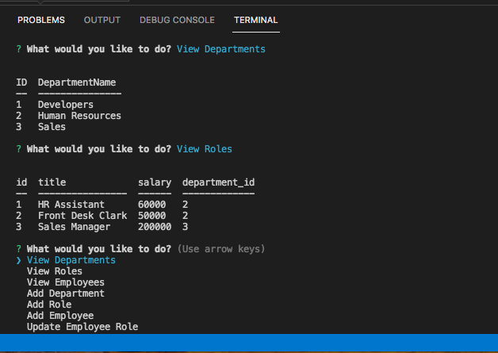

# lekas-employee-tracker
Employee Tracker

Simple command line application using MySQL and inquirer to track employees.

How to use it:
- node index.js
- you are presented with options to select action
- you can add and view roles, departments, employees
- you can update emplyee role

The following image demonstrates the web application's appearance:

To view the demo of this app go to:
https://youtu.be/c2UtoZ-zGHI
